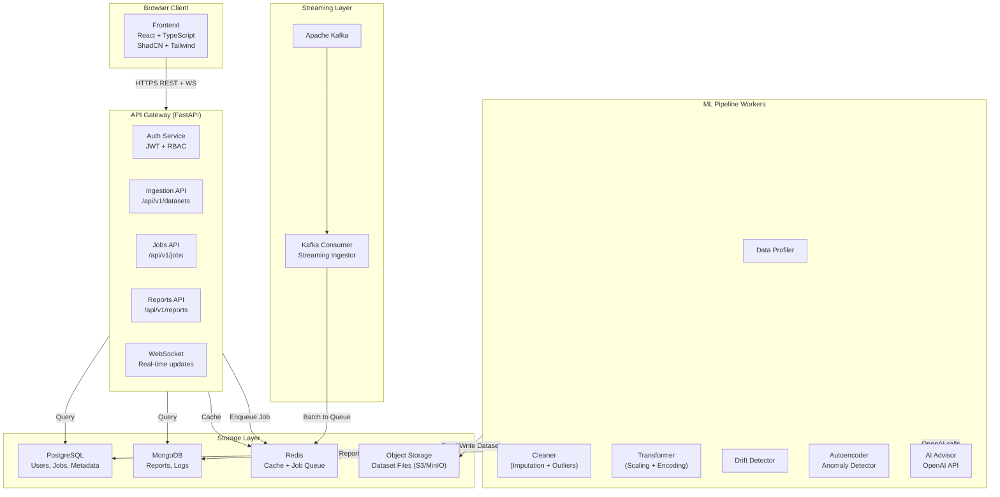

# Design Document: AI Data Quality Intelligence Platform

## Overview

The AI Data Quality Intelligence Platform is a full-stack, production-grade SaaS application that ingests raw datasets, runs a multi-stage AI-powered data quality pipeline, and delivers cleaned, ML-ready outputs with explainable reports. The system is designed for horizontal scalability (Kubernetes), distributed processing (PySpark/Dask), real-time streaming (Kafka), and AI-driven intelligence (OpenAI API).

The platform is organized into five independently deployable services:
- **Frontend** — React + TypeScript + ShadCN + Tailwind CSS
- **API Gateway** — FastAPI (Python) async REST backend
- **ML Pipeline Worker** — PySpark/Dask processing engine running as background workers
- **Streaming Ingestor** — Kafka consumer service
- **Infrastructure** — PostgreSQL, MongoDB, Redis, Kafka

---

## Architecture



### Request Flow

1. User uploads a file or configures a Kafka stream via the Frontend.
2. The API Gateway validates the request, stores the raw file in object storage (S3/MinIO), and creates a Job record in PostgreSQL.
3. A Job message is pushed to a Redis queue (using `rq` or Celery).
4. A Pipeline Worker picks up the Job, runs the full processing pipeline (profile → clean → transform → score → report), and writes results back to storage.
5. The API Gateway pushes real-time status updates to the Frontend via WebSocket.
6. The Frontend polls or receives push updates and renders the dashboard.

---

## Components and Interfaces

### Frontend (React + TypeScript)

**Tech stack**: React 18, TypeScript 5, Vite, ShadCN UI, Tailwind CSS, Recharts, Framer Motion, React Query (TanStack Query), Zustand (state management), React Hook Form + Zod (forms/validation).

**Key pages and components**:

| Route | Component | Description |
|---|---|---|
| `/login` | `AuthPage` | JWT login form |
| `/dashboard` | `DashboardPage` | Overview: quality score gauge, recent jobs, alerts |
| `/datasets` | `DatasetsPage` | Dataset list with upload button |
| `/datasets/:id` | `DatasetDetailPage` | Profile, versions, job history |
| `/jobs/:id` | `JobDetailPage` | Pipeline progress, before/after charts |
| `/reports/:id` | `ReportPage` | AI report viewer + PDF download |
| `/settings` | `SettingsPage` | User profile, alert thresholds, API keys |
| `/admin` | `AdminPage` | User management (Admin role only) |

**Real-time updates**: WebSocket connection to `/ws/jobs/{job_id}` for live pipeline progress. Falls back to 5-second polling if WebSocket is unavailable.

**Theme**: Deep blue (`#0F172A`) background, teal accents (`#14B8A6`), white text. Dark mode default; light mode toggle stored in `localStorage`.

---

### API Gateway (FastAPI)

**Tech stack**: FastAPI 0.111+, Python 3.11+, SQLAlchemy 2.0 (async), Alembic (migrations), Pydantic v2, `python-jose` (JWT), `passlib[bcrypt]`, `celery` + `redis` (task queue), `boto3` (S3), `motor` (async MongoDB).

**API versioning**: All routes prefixed with `/api/v1/`.

**Key route groups**:

```
POST   /api/v1/auth/login
POST   /api/v1/auth/refresh
POST   /api/v1/auth/logout

GET    /api/v1/datasets
POST   /api/v1/datasets          (multipart file upload)
GET    /api/v1/datasets/{id}
DELETE /api/v1/datasets/{id}
GET    /api/v1/datasets/{id}/versions
POST   /api/v1/datasets/{id}/baseline  (set as drift baseline)

POST   /api/v1/jobs              (submit pipeline job)
GET    /api/v1/jobs/{id}
GET    /api/v1/jobs/{id}/status

GET    /api/v1/reports/{id}
GET    /api/v1/reports/{id}/download  (PDF)

GET    /api/v1/datasets/{id}/download?format=csv|xlsx|json

GET    /api/v1/alerts
PATCH  /api/v1/alerts/{id}/acknowledge

GET    /api/v1/admin/users       (Admin only)
POST   /api/v1/admin/users
PATCH  /api/v1/admin/users/{id}

GET    /health
```

**Background task queue**: Celery with Redis broker. Workers run in separate containers. Job status transitions: `PENDING → RUNNING → COMPLETED | FAILED`.

---

### ML Pipeline Worker (PySpark / Dask)

**Tech stack**: Python 3.11, PySpark 3.5, Dask 2024.x, scikit-learn, pandas, numpy, scipy, tensorflow/keras (Autoencoder), openai Python SDK, `reportlab` (PDF generation).

**Pipeline stages** (executed sequentially per Job):

```
Stage 1: Data Loading       → Read from S3 into Spark DataFrame
Stage 2: Data Profiling     → Schema, stats, distributions, correlation
Stage 3: AI Semantic Infer  → OpenAI API call for column semantics
Stage 4: Missing Value Handling → Auto-select + apply imputation
Stage 5: Outlier Detection  → Ensemble (IF + Z-score + IQR + DBSCAN)
Stage 6: Anomaly Detection  → Autoencoder scoring
Stage 7: Data Transformation → Scaling + Encoding + Feature Engineering
Stage 8: Drift Detection    → KS test / chi-squared vs baseline
Stage 9: Quality Scoring    → Compute Completeness, Consistency, Accuracy
Stage 10: Report Generation → AI_Advisor generates narrative + PDF
Stage 11: Output Writing    → Write cleaned dataset to S3 in all formats
Stage 12: Versioning        → Create Version record in PostgreSQL
```

**Spark vs Dask fallback**: At worker startup, the engine attempts to initialize a SparkSession. If Spark is unavailable (e.g., no cluster), it falls back to Dask. The `ProcessingEngine` interface abstracts both:

```python
class ProcessingEngine(Protocol):
    def read_dataset(self, path: str) -> DataFrame: ...
    def write_dataset(self, df: DataFrame, path: str, format: str) -> None: ...
    def compute_profile(self, df: DataFrame) -> DataProfile: ...
    def apply_imputation(self, df: DataFrame, config: ImputationConfig) -> DataFrame: ...
    def detect_outliers(self, df: DataFrame, config: OutlierConfig) -> DataFrame: ...
    def apply_transformations(self, df: DataFrame, config: TransformConfig) -> DataFrame: ...
    def detect_drift(self, df: DataFrame, baseline: DataFrame) -> DriftReport: ...
```

---

### Streaming Ingestor

**Tech stack**: Python 3.11, `confluent-kafka`, `aiokafka`.

**Behavior**: Consumes messages from a configured Kafka topic, accumulates records into micro-batches (configurable window: 1–60 seconds), then submits each batch as a Pipeline Job via the internal API. Supports JSON and CSV-encoded Kafka messages.

---

## Data Models

### PostgreSQL (Relational)

```sql
-- Users
CREATE TABLE users (
    id          UUID PRIMARY KEY DEFAULT gen_random_uuid(),
    email       VARCHAR(255) UNIQUE NOT NULL,
    password_hash VARCHAR(255) NOT NULL,
    role        VARCHAR(50) NOT NULL DEFAULT 'user',  -- 'user' | 'admin'
    is_active   BOOLEAN NOT NULL DEFAULT TRUE,
    created_at  TIMESTAMPTZ NOT NULL DEFAULT NOW(),
    updated_at  TIMESTAMPTZ NOT NULL DEFAULT NOW()
);

-- Datasets
CREATE TABLE datasets (
    id          UUID PRIMARY KEY DEFAULT gen_random_uuid(),
    user_id     UUID NOT NULL REFERENCES users(id),
    name        VARCHAR(255) NOT NULL,
    format      VARCHAR(20) NOT NULL,  -- 'csv' | 'json' | 'xlsx' | 'stream'
    row_count   BIGINT,
    column_count INTEGER,
    file_path   TEXT,                  -- S3 key
    is_baseline BOOLEAN NOT NULL DEFAULT FALSE,
    created_at  TIMESTAMPTZ NOT NULL DEFAULT NOW()
);

-- Dataset Versions
CREATE TABLE dataset_versions (
    id              UUID PRIMARY KEY DEFAULT gen_random_uuid(),
    dataset_id      UUID NOT NULL REFERENCES datasets(id),
    version_number  INTEGER NOT NULL,
    job_id          UUID,
    file_path       TEXT NOT NULL,     -- S3 key for cleaned output
    transform_params JSONB,            -- scaler params, encoder mappings
    quality_score   NUMERIC(5,2),
    created_at      TIMESTAMPTZ NOT NULL DEFAULT NOW()
);

-- Jobs
CREATE TABLE jobs (
    id              UUID PRIMARY KEY DEFAULT gen_random_uuid(),
    dataset_id      UUID NOT NULL REFERENCES datasets(id),
    user_id         UUID NOT NULL REFERENCES users(id),
    status          VARCHAR(20) NOT NULL DEFAULT 'PENDING',
    pipeline_config JSONB NOT NULL,    -- imputation method, outlier method, etc.
    progress        INTEGER NOT NULL DEFAULT 0,  -- 0-100
    error_message   TEXT,
    started_at      TIMESTAMPTZ,
    completed_at    TIMESTAMPTZ,
    created_at      TIMESTAMPTZ NOT NULL DEFAULT NOW()
);

-- Alerts
CREATE TABLE alerts (
    id          UUID PRIMARY KEY DEFAULT gen_random_uuid(),
    user_id     UUID NOT NULL REFERENCES users(id),
    job_id      UUID REFERENCES jobs(id),
    type        VARCHAR(50) NOT NULL,  -- 'quality_drop' | 'drift_detected'
    message     TEXT NOT NULL,
    is_resolved BOOLEAN NOT NULL DEFAULT FALSE,
    created_at  TIMESTAMPTZ NOT NULL DEFAULT NOW()
);
```

### MongoDB (Document Store)

```javascript
// Reports collection
{
  _id: ObjectId,
  job_id: "uuid",
  dataset_id: "uuid",
  user_id: "uuid",
  quality_score: {
    overall: 85.3,
    completeness: 92.1,
    consistency: 88.4,
    accuracy: 75.5
  },
  data_profile: {
    row_count: 1000000,
    column_count: 24,
    columns: [
      {
        name: "age",
        dtype: "int64",
        missing_pct: 2.3,
        semantic_type: "age_years",
        semantic_confidence: 0.94,
        stats: { mean: 34.2, std: 12.1, min: 18, max: 95, p25: 25, p50: 33, p75: 44 }
      }
    ],
    correlation_matrix: { ... }
  },
  issues_found: [
    { column: "age", type: "missing_values", count: 2300, pct: 2.3 },
    { column: "salary", type: "outliers", count: 450, method: "ensemble" }
  ],
  fixes_applied: [
    { column: "age", action: "knn_imputation", params: { k: 5 } },
    { column: "salary", action: "winsorization", params: { lower: 0.01, upper: 0.99 } }
  ],
  drift_report: {
    baseline_dataset_id: "uuid",
    drifted_columns: ["income", "age"],
    ks_stats: { income: { statistic: 0.23, p_value: 0.001 } }
  },
  ai_narrative: "The dataset contained 2.3% missing values in the age column...",
  recommendations: ["Consider collecting more data for the salary column", "..."],
  pdf_path: "s3://bucket/reports/report-uuid.pdf",
  created_at: ISODate
}

// Processing logs collection
{
  _id: ObjectId,
  job_id: "uuid",
  stage: "outlier_detection",
  level: "INFO",
  message: "Detected 450 outliers in salary column using ensemble method",
  timestamp: ISODate,
  metadata: { ... }
}
```

### Redis (Cache + Queue)

- **Job queue**: Celery task queue using Redis as broker (`celery://redis:6379/0`)
- **Cache keys**:
  - `profile:{dataset_id}` → serialized DataProfile JSON (TTL: 2 hours)
  - `job_status:{job_id}` → job progress integer (TTL: 24 hours)
  - `user_session:{user_id}` → JWT refresh token (TTL: 7 days)
  - `rate_limit:{user_id}` → request counter (TTL: 60 seconds)

---

## Correctness Properties

*A property is a characteristic or behavior that should hold true across all valid executions of a system — essentially, a formal statement about what the system should do. Properties serve as the bridge between human-readable specifications and machine-verifiable correctness guarantees.*

### Property-Based Testing Overview

Property-based testing (PBT) validates software correctness by testing universal properties across many generated inputs. Each property is a formal specification that should hold for all valid inputs. We use **Hypothesis** (Python) for backend/pipeline properties and **fast-check** (TypeScript) for frontend properties.

Each property test runs a minimum of 100 iterations. Tests are tagged with the format:
`Feature: ai-data-quality-platform, Property {N}: {property_text}`

---

Property 1: Data Quality Score bounds invariant
*For any* dataset after pipeline processing, the Data Quality Score and each of its three components (Completeness, Consistency, Accuracy) SHALL always be a value in the range [0, 100].
**Validates: Requirements 10.1, 10.2, 10.3, 10.4**

---

Property 2: Completeness score matches missing value count
*For any* dataset with a known number of total cells and missing cells, the Completeness score SHALL equal `(total_cells - missing_cells) / total_cells * 100`, and after imputation is applied, the Completeness score SHALL be 100.
**Validates: Requirements 10.2, 4.1**

---

Property 3: Imputation eliminates missing values
*For any* dataset and any imputation strategy (KNN, MICE, Regression, mean/median/mode), after imputation is applied to a column, that column SHALL contain zero missing values (null, NaN, or empty string).
**Validates: Requirements 4.1, 4.2**

---

Property 4: Outlier detection ensemble agreement
*For any* dataset and any data point flagged by the ensemble outlier detector, at least two of the four individual methods (Isolation Forest, Z-score, IQR, DBSCAN) SHALL have independently flagged that same data point.
**Validates: Requirements 5.4**

---

Property 5: Transformation round-trip (scaling)
*For any* numeric column and any scaler (StandardScaler, RobustScaler), applying the scaler and then its inverse transform SHALL produce values within floating-point tolerance (1e-6) of the original values.
**Validates: Requirements 7.1, 7.3**

---

Property 6: Encoding round-trip (label encoding)
*For any* categorical column and Label Encoding, applying encoding and then decoding SHALL produce the original categorical values exactly.
**Validates: Requirements 7.2, 7.3**

---

Property 7: Dataset versioning monotonicity
*For any* dataset that has undergone N pipeline jobs, the version numbers SHALL form a strictly increasing sequence starting at 1, with no gaps.
**Validates: Requirements 12.1, 12.2**

---

Property 8: Report serialization round-trip
*For any* Report object, serializing it to JSON and deserializing it SHALL produce an object equal to the original.
**Validates: Requirements 9.1**

---

Property 9: JWT authentication validity
*For any* valid JWT token issued by the Platform, decoding it with the correct secret SHALL yield the original user ID and role without error.
**Validates: Requirements 1.1, 1.3**

---

Property 10: Rate limiting enforcement
*For any* authenticated user, submitting more than 100 API requests within a 60-second window SHALL result in HTTP 429 responses for all requests beyond the 100th.
**Validates: Requirements 15.4**

---

Property 11: Drift detection symmetry
*For any* dataset compared against itself as the baseline, the KS test p-value for all numeric columns SHALL be greater than 0.05 (no drift detected).
**Validates: Requirements 8.1**

---

Property 12: Quality score alert threshold
*For any* computed Data Quality Score below the configured threshold, an alert record SHALL exist in the alerts table for the corresponding user and job.
**Validates: Requirements 10.6, 16.1**

---

## Error Handling

| Scenario | Behavior |
|---|---|
| File upload exceeds 2 GB | HTTP 413 with descriptive message |
| Unsupported file format | HTTP 422 with list of supported formats |
| Column >80% missing | Column flagged in report; imputation skipped; user notified |
| OpenAI API unavailable | Pipeline continues without AI narrative; report marked as "AI unavailable" |
| Spark unavailable | Automatic fallback to Dask; logged in job metadata |
| Job fails mid-pipeline | Status set to FAILED; partial results discarded; error message stored |
| Invalid JWT | HTTP 401 Unauthorized |
| Unauthorized resource access | HTTP 403 Forbidden |
| Rate limit exceeded | HTTP 429 with Retry-After header |
| Database connection failure | HTTP 503 with retry guidance |

All API errors follow a consistent schema:
```json
{
  "error": {
    "code": "VALIDATION_ERROR",
    "message": "File size exceeds the 2 GB limit",
    "request_id": "req_abc123"
  }
}
```

---

## Testing Strategy

### Dual Testing Approach

Both unit tests and property-based tests are required. They are complementary:
- **Unit tests** verify specific examples, edge cases, and integration points.
- **Property tests** verify universal correctness across randomly generated inputs.

### Backend / Pipeline Testing

**Framework**: `pytest` + `Hypothesis` (PBT) + `pytest-asyncio` (async FastAPI tests) + `httpx` (API client).

**Property test configuration**:
```python
from hypothesis import given, settings
settings.register_profile("ci", max_examples=100)
settings.load_profile("ci")
```

Each property test is tagged:
```python
@given(...)
@settings(max_examples=100)
# Feature: ai-data-quality-platform, Property 3: Imputation eliminates missing values
def test_imputation_eliminates_missing_values(df, strategy):
    ...
```

**Test structure**:
```
backend/tests/
  unit/
    test_auth.py
    test_quality_score.py
    test_drift_detection.py
  property/
    test_quality_score_properties.py   # Properties 1, 2
    test_imputation_properties.py      # Property 3
    test_outlier_properties.py         # Property 4
    test_transformation_properties.py  # Properties 5, 6
    test_versioning_properties.py      # Property 7
    test_report_properties.py          # Property 8
    test_auth_properties.py            # Properties 9, 10
    test_drift_properties.py           # Property 11
    test_alert_properties.py           # Property 12
  integration/
    test_pipeline_end_to_end.py
    test_api_endpoints.py
```

### Frontend Testing

**Framework**: Vitest + React Testing Library + `fast-check` (PBT).

**Test structure**:
```
frontend/src/
  __tests__/
    unit/
      QualityScoreGauge.test.tsx
      DataProfileTable.test.tsx
    property/
      qualityScore.property.test.ts    # Property 1 (frontend rendering)
```

### Load Testing

**Framework**: `locust` for API load testing.

Target: 100 concurrent users, 10M-row dataset processed within 15 minutes.

---

## Project Structure

```
ai-data-quality-platform/
├── frontend/
│   ├── src/
│   │   ├── components/
│   │   │   ├── ui/              # ShadCN components
│   │   │   ├── charts/          # Recharts wrappers
│   │   │   ├── layout/          # Sidebar, Header, ThemeToggle
│   │   │   └── features/        # Domain components (DatasetCard, JobProgress, etc.)
│   │   ├── pages/               # Route-level page components
│   │   ├── hooks/               # Custom React hooks
│   │   ├── store/               # Zustand state slices
│   │   ├── api/                 # TanStack Query + axios API client
│   │   ├── types/               # TypeScript interfaces
│   │   └── lib/                 # Utilities, theme config
│   ├── public/
│   ├── index.html
│   ├── vite.config.ts
│   ├── tailwind.config.ts
│   └── Dockerfile
│
├── backend/
│   ├── app/
│   │   ├── api/
│   │   │   └── v1/
│   │   │       ├── auth.py
│   │   │       ├── datasets.py
│   │   │       ├── jobs.py
│   │   │       ├── reports.py
│   │   │       ├── alerts.py
│   │   │       └── admin.py
│   │   ├── core/
│   │   │   ├── config.py        # Settings via pydantic-settings
│   │   │   ├── security.py      # JWT + bcrypt
│   │   │   └── dependencies.py  # FastAPI dependency injection
│   │   ├── db/
│   │   │   ├── postgres.py      # SQLAlchemy async engine
│   │   │   ├── mongo.py         # Motor async client
│   │   │   ├── redis.py         # Redis client
│   │   │   └── models.py        # SQLAlchemy ORM models
│   │   ├── schemas/             # Pydantic request/response schemas
│   │   ├── services/            # Business logic layer
│   │   ├── tasks/               # Celery task definitions
│   │   └── main.py              # FastAPI app factory
│   ├── alembic/                 # DB migrations
│   ├── tests/
│   ├── requirements.txt
│   └── Dockerfile
│
├── ml_pipeline/
│   ├── pipeline/
│   │   ├── engine.py            # ProcessingEngine protocol + factory
│   │   ├── spark_engine.py      # PySpark implementation
│   │   ├── dask_engine.py       # Dask fallback implementation
│   │   ├── profiler.py          # Stage 2: Data profiling
│   │   ├── imputer.py           # Stage 4: Missing value handling
│   │   ├── outlier_detector.py  # Stage 5: Outlier detection
│   │   ├── anomaly_detector.py  # Stage 6: Autoencoder anomaly detection
│   │   ├── transformer.py       # Stage 7: Scaling + encoding
│   │   ├── drift_detector.py    # Stage 8: Drift detection
│   │   ├── scorer.py            # Stage 9: Quality scoring
│   │   └── report_generator.py  # Stage 10: AI report + PDF
│   ├── ai/
│   │   └── advisor.py           # OpenAI API integration
│   ├── tests/
│   ├── requirements.txt
│   └── Dockerfile
│
├── streaming/
│   ├── ingestor.py              # Kafka consumer + batch submitter
│   ├── config.py
│   ├── requirements.txt
│   └── Dockerfile
│
├── docker/
│   └── docker-compose.yml
│
└── deployment/
    ├── k8s/
    │   ├── frontend-deployment.yaml
    │   ├── backend-deployment.yaml
    │   ├── worker-deployment.yaml
    │   ├── streaming-deployment.yaml
    │   ├── postgres-statefulset.yaml
    │   ├── redis-deployment.yaml
    │   └── configmap.yaml
    └── helm/                    # Optional Helm chart
```
